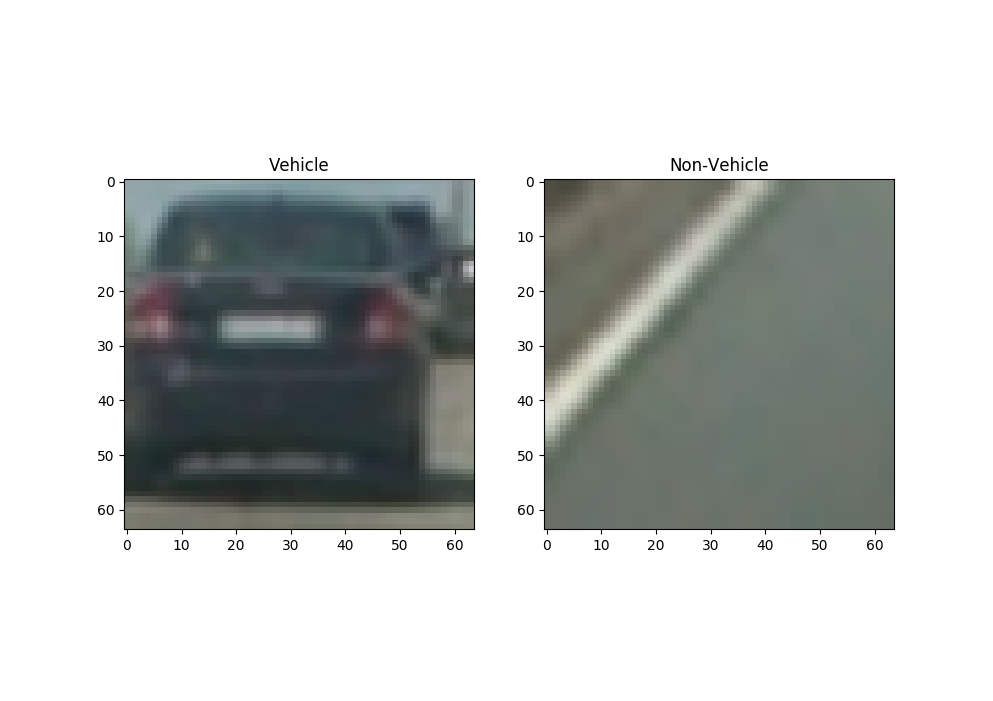
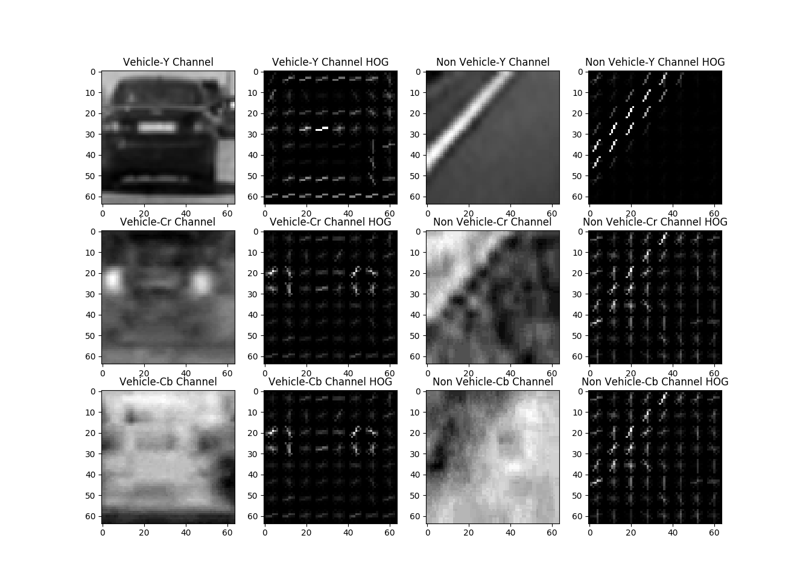

**Vehicle Detection**

The steps of this project are the following:

* Using an appropriate color domain representation, perform a Histogram of Oriented Gradients (HOG) feature extraction on a labeled training set of images and train a classifier Linear SVM classifier.
* Supplement these features with binned color features, as well as histograms of color, to the HOG feature vector. 
* Implement a sliding-window technique and use the trained classifier to search for vehicles in images.
* Run the pipeline on a video stream. Use heat map of recurring detections frame by frame to reject outliers and follow detected vehicles.
* Estimate a bounding box for vehicles detected.

---
### Color domain
_YCrCb_ showed the best performance when training the SVM model with various features compared to RGB, LUV, HSL etc. So we use this for the rest of the project.

###Feature selection for training - Histogram of Oriented Gradients (HOG)
This technique generates histograms of image intensity gradients within a given block. This is useful in extracting features from a larger image that can be used for various purposes. Its most useful when trying to ascertain shape related aspects from the image.

In this case, we use these to generate features for images of cars, from various angles and lighting conditions. I use [skimage.feature.hog](http://scikit-image.org/docs/0.11.x/api/skimage.feature.html#skimage.feature.hog) function to generate these.
The code can be seen [here](./src/main/python/utils.py#L17:L35).

When used on the an example image like the one shown below.

The hog function results look like the following:

#### HOG parameters
I used 8x8 pixels per cell, and 2x2 cells per block for normalization and 9 orientations for generating the examples above. I used the same parameters to generate features for training the SVM model.
These parameters showed the best performance for the sliding window based feature detection we intend to perform later.

####Additional features to supplement HOG features
Since cars tend to stand out because of the color and contrast, using both spatial color information and possible a histogram of colors can give good results for classification.

For spatial color information, I resize the image to a 32x32 pixel image and use all the intensities as a linear vector. This is further supplemented by a 32-bin histogram of all the channels.

