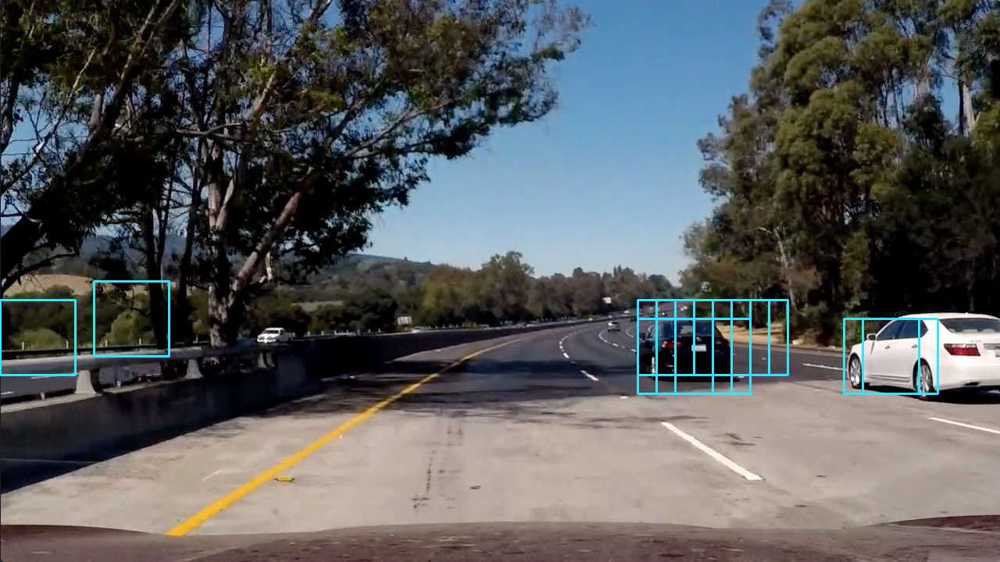
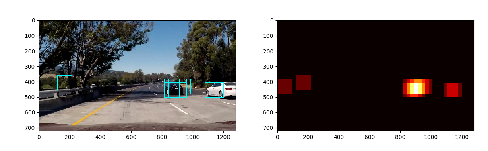
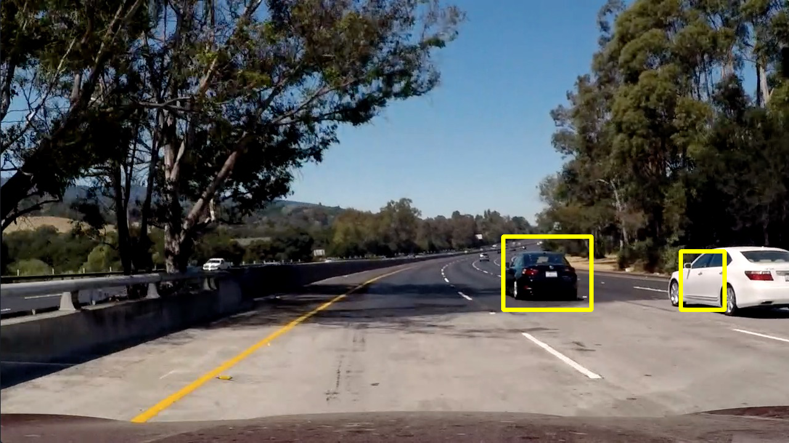

**Vehicle Detection**

The steps of this project are the following:

* Using an appropriate color domain representation, perform a Histogram of Oriented Gradients (HOG) feature extraction on a labeled training set of images and train a classifier Linear SVM classifier.
* Supplement these features with binned color features, as well as histograms of color, to the HOG feature vector. 
* Implement a sliding-window technique and use the trained classifier to search for vehicles in images.
* Run the pipeline on a video stream. Use heat map of recurring detections frame by frame to reject outliers and follow detected vehicles.
* Estimate a bounding box for vehicles detected.

---
### Color domain
_YCrCb_ showed the best performance when training the SVM model with various features compared to RGB, LUV, HSL etc. So we use this for the rest of the project.

###Feature selection for training - Histogram of Oriented Gradients (HOG)
This technique generates histograms of image intensity gradients within a given block. This is useful in extracting features from a larger image that can be used for various purposes. Its most useful when trying to ascertain shape related aspects from the image.

In this case, we use these to generate features for images of cars, from various angles and lighting conditions. I use [skimage.feature.hog](http://scikit-image.org/docs/0.11.x/api/skimage.feature.html#skimage.feature.hog) function to generate these.
The code can be seen [here](./src/main/python/utils.py#L18:L36).

When used on the an example image like the one shown below.

The hog function results look like the following:

#### HOG parameters
I used 8x8 pixels per cell, and 2x2 cells per block for normalization and 9 orientations for generating the examples above. I used the same parameters to generate features for training the SVM model.
These parameters showed the best performance for the sliding window based feature detection we intend to perform later.

####Additional features to supplement HOG features
Since cars tend to stand out because of the color and contrast, using both spatial color information and possible a histogram of colors can give good results for classification.
This is implemented [here](./src/main/python/utils.py#L39:L44)

For spatial color information, I resize the image to a 32x32 pixel image and use all the intensities as a linear vector. This is further supplemented by a 32-bin histogram of all the channels.
This is implemented [here](./src/main/python/utils.py#L47:L57)

Feature vectors are created by putting these 3 different features together. Since they can be on different scales, we _normalize_ them
by using a `StandardScaler`. We use the scaler in the detection pipeline as shows [here](./src/main/python/CarDetectionModel.py#L47:L48)

We then fit a linear Support Vector Classifier. We tune parameter C by using 3-fold cross-validation based grid-search.
This is shown [here](./src/main/python/CarDetectionModel.py#L58:L62). Once the fit is complete, we extract and save the best
model like shown [here](./src/main/python/CarDetectionModel.py#L64:L77)

###Sliding window search
Once a model is trained using the images/features shown above, it can be used on target images using a sliding window. We choose a window of
the same size as the training image and slide this window over the area of interest in the image. This is done in the code
[here](./src/main/python/utils.py#L129:L194).

The approach basically pulls out a 64x64 section from the area of interest, generates features from this, just like we did in training
the model and then predicts if this portion contains a car. The window is then moved by 2 cells (where each cell is a 8x8 block, therefore
the window is moved by 16 pixels) and this exercise is repeated. This results in neighboring windows covering about 75% of the area covered by a window.
 This showed the best performance in the test images. Once we completely scan the area of interest, we would have (depending on
the model performance) a number of blocks where we expect the car to be present. An example output image looks like the following:

Several interesting things to note here:
* We can search a different scales, which is to mean, that we can scale this image and then perform the same windowed search operation.
In this case, I found a scale of 1.5 to work the best and used that for the result video.
* We can significantly limit the area of interest in the image, since we only expect cars to be present in the bottom half of the image. In this case, from about 10% to 50% starting from the bottom. This significantly reduces the area that needs to be searched and can improve performance and reduce false positives.
* There is a good chance we see false positives, like we do in this image, and multiple positives around cars, like we see here.
The classifier can be improved to address some of the issue here by adding a more varied set of images for both vehicles and non-vehicles.
It could also be done by trying more features from existing images. We intend for the classifier to be good at identifying
_objects_ (in this case cars) by looking at features. Apart from this, false negatives can also be reduce by other approaches as discussed
in the next section.

###Video implementation and video for noise reduction
The output video can be seen [here](./project_video_output.mp4).

As shown earlier, there can be false positives. There are a few ways to handle this.
* Using a heat-map based approach
This is implement [here](./src/main/python/utils.py#L197:L224). We count how many times a pixel appears in one of the windows. We use this
to generate a heat map like the one show below:

We then use `label` from `scipy.ndimage.measurements` to generate labels for the connected components. These are pixels that are _hotter_ than
a threshold and connected to one another. We can then use these labels to find enclosing boxed around the image. The final image looks like the following:

* Using information from previous images, when working with videos, like we do here.
The approach above can still result in false-positives. We try to minimize these by using information from previous frames of a video. A simplistic
approach is to just collect the boxes from past few images and then use them all together to detect images. This is implemented
[here](./src/main/python/Main.py#L9:L43).

This ensures that detection near the same places in consecutive frames is used to filter out false positives. When using this,
we raise the threshold levels appropriately, so we only pick windows that were detected in multiple images.

###Conclusion
We experimented with a feature extraction + ML based approach here to detect interesting aspects from a stream of images. In this case,
we were interested in locating cars. Given the nature of the problem, our detection can only be as good as the training set. It was
apparent that the classifier appears to do poorly on cars with certain colors, likely due to the colors being absent from the training set.

The road also has a lot of features that are mistaken for cars, particularly around shadows. This is something we cannot get away from, as the
training set does contain images of cars from different angles and light conditions, and we want to be able to detect those as well. These
false positives can, however, be handled using a couple of approaches mentioned above. These help reduce false-positives.

Even with these we see some spurious detection, particularly around the shadows. These approaches can be further improved by tracking
the vehicles that are detected between multiple frames. A potential approach could be to only search for a vehicle around a given region, if
 there was a high confidence detection in the previous frames.

All in all though, the basic approach shown here does show decent performance that can be improved on.